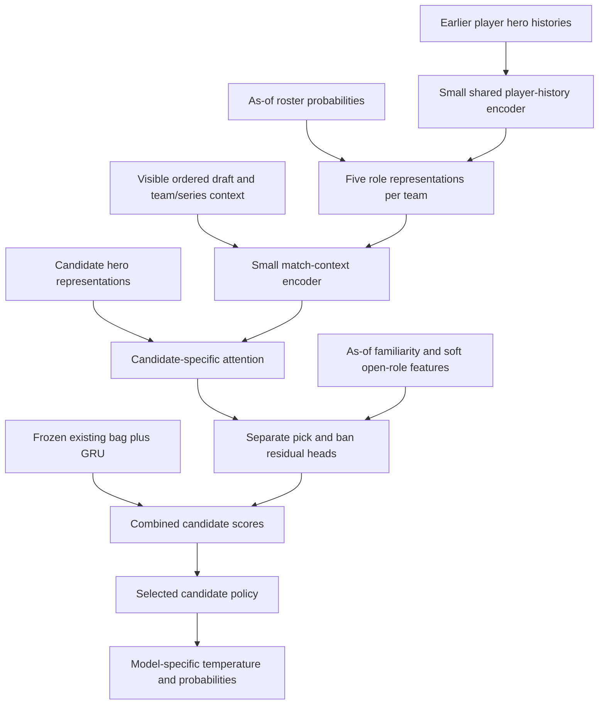

# Model specification: personalized KPL draft policy inspired by DraftRec

Status: design for implementation and evaluation. This is a proposed KPL adaptation, not a claim that the architecture has already improved results.

Read [START_HERE.md](START_HERE.md) and use the scoring/evaluation contracts in [01_CALIBRATION.md](01_CALIBRATION.md). Use existing local exports; downloading new games and fixing data-refresh automation are out of scope.

## 1. Objective and design choice

Predict the next observed hero choice over all available candidates, conditioned on:

- the ordered current draft;
- acting/opponent team and side;
- both teams' previous-game hero usage;
- historically plausible active players and their hero preferences;
- uncertainty about which role will receive a picked hero;
- the distinct information useful for picks versus bans.

The production candidate should be a **personalization residual on the existing frozen sequence model**, not an immediate full replacement. This preserves the useful current behavior and makes the incremental value of personalization measurable.

Proposed internal name: `personalized_bag_gru`; optional simulator model ID: `personalized`. Verify those names are unused when implementing.

DraftRec uses a player-history network followed by a match network, and trains choice and outcome predictions. Its original setting associates draft turns with players. We borrow the hierarchical use of past preferences and current match context, but do not copy that player-turn assumption or joint win objective into KPL. [DraftRec, Lee et al., WWW 2022, sections 3–4](https://arxiv.org/html/2204.12750v1).

Everything below is a project-specific design proposal. Its dimensions, role mixture, residual gate, losses, and adoption criteria are not reported DraftRec results.

## 2. Important KPL adaptations

**A pick is a team choice with an unknown eventual recipient.** Do not attach the current target hero to the player who appears in the final battle lineup. Heroes can be exchanged and can fill multiple roles. Marginalize over plausible recipients/roles instead.

**A team name does not establish the exact active roster.** The existing roster tool lists players observed across the entire season and explicitly is not an official current roster. It cannot supply leakage-free historical starters.

**Bans have an opponent-facing objective.** A separate prediction head should use the opponent's plausible hero pool and remaining roles, plus the acting team's own preference and visible draft. It remains a supervised choice predictor, not a strategic ban-value estimator.

**Data is limited.** Use small shared encoders, explicit shrinkage, and a frozen baseline. No large pretrained language model, external player API, reinforcement learning, win-value joint loss, or new patch ingestion is required for version 1.

## 3. Input construction and provenance

### 3.1 Sources

Use `analysis/exports/<season>/matches.jsonl` for historical players/roles and `bp_decisions.jsonl` for pre-action draft state. Reuse source parsing logic where useful. Keep temporal feature generation separate from the full-season summaries in `compute_team_draft_profiles.py`.

Do not feed `player_hero_pools.jsonl`, `power_rankings.json`, current-season roster queries, or global learned statistics into historical folds unless they were rebuilt using the same strict cutoff. Full-season aggregates can contain the target and later matches.

Make a deterministic experiment manifest listing exact source seasons and file hashes. Derive training vocabularies only from that fold's training data. Use known external hero catalogue IDs only with documented feature-vintage assumptions; unavailable historical feature snapshots must be disclosed rather than represented as fully point-in-time historical mechanics.

### 3.2 Time rule

For a decision in a series dated D:

- General player histories, roster frequencies, role priors, and familiarity counts may use only games from **calendar dates earlier than D**. Completion times are not reliably available, so exclude other same-day series by default.
- Within-series prior-game hero usage comes from the existing pre-action fields and may be used immediately.
- Version 1 does not update general player-history vectors from earlier games in the current series. This keeps the availability rule reproducible and avoids reconstruction ambiguity.
- A confirmed roster can be used only when a provenance record establishes it was supplied before the series/game. For historical evaluation, absence of that record means inferred/unknown, not “recover starters from the final lineup.”
- All prefixes contain only actions with `bp_order < next_order`.

Snapshots must store `context_as_of`, maximum source event date, source match IDs or a reproducible source-set hash, and `roster_source`. Changing later records must not alter earlier inputs.

Evaluation of inferred context is chronological: observed games from earlier evaluation dates may become context for later dates, but weights/hyperparameters stay frozen. Label this **online context, fixed neural weights**. Also run a frozen-context sensitivity check using only pre-H history so the benefit of context updates is visible.

### 3.3 Player identity

The current tables primarily expose player name and team ID, not a proven stable cross-team account ID. Default key:

```text
player_key = team_id + ":" + conservatively_normalized_player_name
```

Strip harmless whitespace and normalize Unicode consistently. Do not fuzzy-merge similar names or automatically join transfers across teams. An optional explicit reviewed alias map can merge identities; version and hash it. An unrecognized/ambiguous player uses an unknown ID plus any safely attributable history. Shared history encoding must work for a player not seen during neural training.

### 3.4 Roster inference

For each team and each of the five verified role IDs:

1. Consider at most the team's latest 20 eligible historical games, no older than 120 days.
2. Count observed player appearances at that role with 30-day half-life.
3. Retain the two highest-weight known players, breaking ties deterministically by canonical key.
4. Include an explicit unknown player component. Its mass is discarded known-player mass plus a pseudocount of 1. Normalize retained weights and unknown mass together.
5. Missing role history gives unknown probability 1. Unknown is not a fabricated starter.

This yields **five role slots × three components** per team: up to two named players and one unknown. Probability reflects an empirical roster hypothesis, not a calibrated lineup forecast. Evaluate and label inferred versus genuinely confirmed rosters separately.

A confirmed complete roster, when actually available, assigns its declared players to role slots with provenance and still permits uncertainty over hero allocation. For version 1, offline inferred-roster support is mandatory; new roster-selection UI is optional and must not delay the model experiment.

### 3.5 Player histories and numerical features

For each retained player, take up to K=20 earlier games, oldest to newest, padding with a separate mask. Fields:

- hero ID and known hero feature vector;
- role ID;
- history position and days before context cutoff;
- count of eligible prior games and time since last appearance;
- shrunk player–hero usage fraction derived from earlier games only.

Version 1 omits K/D/A, damage, gold, MVP, and win labels from player tokens. They can be a later ablation once availability and normalization are audited. Current-game outcomes/performance are never inputs.

For history counts, define `reliability = n_eff / (n_eff + 10)`, with `n_eff` the sum of 30-day-decayed historical observation weights. Blend a player's learned history vector toward its team/role fallback using that reliability. Count summaries can use more than 20 historical games within the 120-day horizon; record this distinction from the K-token truncation.

Player–hero familiarity should use hierarchical smoothing toward the team's role/hero distribution, then league role/hero distribution. Use a pseudocount of 10 at each player/team level initially. Apply a small positive hero prior so unseen choices stay possible. Fit/tune those constants only on V if the initial experiment warrants it.

### 3.6 Dataset contract

Extend preparation using a versioned context dataset, without breaking existing model classes. Required fields in addition to the existing sequence tensors:

| Field | Shape / meaning |
| --- | --- |
| `roster_player_ids` | `[B,2,5,3]`; own/opponent × role × roster component |
| `roster_weights` | Same shape; each role sums to 1 |
| `player_history_hero_ids` | `[B,2,5,3,K]` with K=20 |
| `player_history_roles`, `player_history_age_days`, `player_history_mask` | Same history shape |
| `player_history_reliability` | `[B,2,5,3]` |
| `player_hero_familiarity` | `[B,2,5,H]`, roster-marginalized and smoothed |
| `hero_role_prior` | `[B,H,5]` or a referenced shared as-of matrix |
| `open_role_probability` | `[B,2,5]`, derived from visible picks only |
| `roster_source`, `context_id` | Audit metadata, not free-text neural inputs |

H is the actual vocabulary size; do not hard-code 123. Role IDs are mapped through a verified role vocabulary; do not assume they are consecutive 0–4 in the raw exports. Avoid storing the same history tensor for every BP action: keep a context table and batch through context IDs.

The only label for the primary loss is the actual selected hero. Store outcomes/final player assignments outside the input object for diagnostics if needed. Explicitly test that changing them does not change input tensors.

## 4. Soft uncertainty over roles

Build hero-role priors from historical observations before the context cutoff, shrunk toward training-safe role metadata. Every role has positive fallback mass; a role never observed for a hero is unlikely, not impossible.

For each team's k visible picks, enumerate injective assignments to the five roles. There are at most 120 assignments for k≤5. Give each assignment weight proportional to the product of the participating hero-role priors, computed in log space. Normalize the weights.

```text
open_probability[r] = sum_assignment P(assignment | visible picks)
                     * indicator(role r is unfilled)
```

With no picks, all five values are 1. With k picks their sum is 5-k. This is a heuristic posterior under factorized role priors, not a claim to infer the true allocation perfectly.

For candidate h and team X, derive:

```text
role_fit_X(h) = sum_r open_probability_X[r] * P(role=r | hero=h)
affinity_X(h) = sum_r normalized_open_probability_X[r]
               * roster_marginal_player_affinity_X(r,h)
```

These are finite input features. They do not hard-mask any otherwise game-available hero. When a side has no open roles, use zero and an explicit no-open-role indicator rather than dividing by zero. Prior-game Global-BP restrictions remain actual pick-availability rules; their effects on opponent ban preference can also be represented as features without making those bans formally illegal.

This soft-role reasoning is internal to the candidate scorer. The external serving candidate policy is an independent, versioned choice. Compare baseline and candidate under the **same** policy; do not attribute a mask change to the neural architecture.

## 5. Architecture



### 5.1 Sizes and building blocks

Initial defaults, held fixed for the first neural comparison:

- Hidden width d=48; two attention heads of width 24.
- Player encoder: one pre-LayerNorm attention block, FFN width 96, ReLU, dropout 0.1.
- Match encoder: one block with the same width/heads/FFN/dropout.
- Candidate cross-attention: two heads; no candidate-to-candidate self-attention in v1.
- History K=20; source draft length at most 19; five role tokens per side.
- Player ID embedding width 16, projected to d; regularized strongly and dropped on 20% of known player occurrences during training. Unknown ID embedding is zero.
- All embedding dimensions/vocab sizes come from the model config. Count parameters and report trainable and total sizes; target at most 250k added trainable parameters. If identity tables exceed that cap, omit ID embeddings rather than silently growing the model.
- Implement attention, LayerNorm and ReLU in a way straightforward to reproduce in NumPy. No opaque custom GPU operators.

### 5.2 Candidate hero representations

Use the same hero catalogue features as the baseline, but a separate small trainable projection and hero residual for the new branch:

```text
e_h = W_feature * features_h + hero_residual_h
```

Initialize compatibly with the baseline where shapes match, but keep all baseline weights frozen. Unknown heroes outside the exported vocabulary require an explicit unsupported-candidate diagnostic/fallback; do not silently index them as another hero. Known-vocabulary heroes with sparse appearances can rely on catalogue features and shared statistics.

### 5.3 Player network

History tokens contain hero representation + role embedding + chronological-position embedding + a projection of `log1p(age_days)`. Append a learned summary token and run the one-block player encoder over the available past history. All history is prior to the decision, so bidirectional attention within that past-only history is allowed; padded entries are masked.

Take the summary token output and add the projected player ID embedding and count/recency features. Shrink the result toward team/role context using reliability. Empty history must bypass all-masked attention and return the documented fallback, with no NaNs.

Average player representations using roster probabilities to obtain each team's five role tokens. Include unknown mass explicitly. Add role, own/opponent relation, roster-source category, and coverage features to those tokens.

### 5.4 Match network

Memory tokens comprise:

- up to 19 observed BP actions, each with hero, action, side, own/opponent relation, absolute order and relative lag;
- ten roster-marginal role tokens;
- one next-action context token with acting/opponent team, next action/side/order/slot;
- two summaries of previous-game hero usage, using the existing pre-action fields.

There are at most 32 tokens. The match encoder may attend bidirectionally over this **fully observed prefix**; no future hero tokens or target hero are placed in memory. Hero candidate queries are created separately for scoring all candidates equally.

Team/role tokens have semantic role embeddings rather than arbitrary player-list positional embeddings. Shuffling the roster components with their weights must not change predictions. Draft action order must remain meaningful.

### 5.5 Candidate attention and separate heads

Each candidate hero queries the match memory using its representation and next-action context. Concatenate its attended vector, hero representation, and these scalar features:

- own and opponent affinity;
- own and opponent role fit;
- whether each side used the hero in prior games;
- own/opponent roster coverage and no-open-role indicators.

Use separate small MLP heads for pick and ban actions. Both heads can see both teams' information; the ban head is not restricted to the acting team's preferences. No hard-coded positive coefficient assumes that every high-affinity opponent hero will be banned.

Return finite residual scores `r_h`. Center them over accepted candidates and bound them:

```text
r_centered[h] = r[h] - mean(r[accepted_candidates])
delta[h] = tanh(r_centered[h])
gate(s) = coverage(s) * sigmoid(gate_MLP(context))
final_score[h] = frozen_sequence_score[h] + gate(s) * delta[h]
```

`coverage` is the mean known-history reliability over the ten roster role slots, weighted by roster probabilities, clipped to [0,1]. No usable history on either side means coverage=0 and exact baseline behavior. Unknown player IDs can still have nonzero coverage when attributable historical records are available.

Initialize gate sigmoid to 0.05 and use gate penalty `1e-3 * mean(gate²)`. The correction is bounded to ±1 logit and starts small. This bound/gate is a design safeguard, not a confidence estimate. Later experiments may vary it using V only.

Do not reuse a calibrated baseline's temperature inside the combined scores. Combine raw baseline and residual scores first; fit a new temperature for the final composite model using its own C window.

### 5.6 Runtime reuse

Cache player-history encodings once per `(model_fingerprint, context_id)`. Share them across the 20-action simulation and candidate rollouts. Recompute draft-memory attention and open-role probabilities when picks/bans change. Never cache those dynamic values by team IDs alone.

Do not invent future players or outcomes inside rollouts. Keep roster/history context fixed during each simulated game's draft; update only the draft prefix and legal availability. Batch all hero queries for a state in one matrix operation.

## 6. Build a simpler comparator first

Before the attention model, implement a **familiarity residual** using the same temporally safe context:

```text
z_simple(h) = z_frozen(h) + linear_head_action(
    own_affinity, opponent_affinity,
    own_role_fit, opponent_role_fit,
    previous_game_usage_flags, coverage)
```

Use a bounded residual with the same coverage fallback. This has very few trainable parameters and separates “new information helps” from “attention helps.” The neural model must beat this comparator to justify its complexity. A shrunk empirical player-preference-only predictor is an additional sanity check, not the production baseline.

## 7. Training protocol

Use the shared whole-series training/V/C/H manifests. Preserve an exact fold baseline and never use the all-data-refit artifact as that fold's unseen-data comparator.

Train the baseline on training data and select its checkpoint on V, then freeze it. Train only the new branch on the training block, selecting its epoch on V. Using the same V for these decisions is acceptable development validation; C and H remain separate.

Primary loss:

```text
mean weighted categorical cross-entropy over the full accepted hero set
+ gate penalty
```

No sampled-negative objective is needed with approximately 123 heroes. Use exact masked softmax. No label smoothing or focal loss in the initial experiment because both complicate the probability objective.

Initial settings:

- AdamW, learning rate 0.001, weight decay 0.0001.
- Batch size 128; gradient clipping at norm 1.
- At most 30 epochs; select lowest V NLL, early-stop after 5 non-improving epochs.
- Seeds 7, 17 and 29 for confirmatory comparisons; start with seed 7 for engineering.
- Baseline reproduction preserves its documented recency/winner weights. Add a **separate** uniform-winner-weight baseline and use the same chosen weighting for its corresponding simple/neural candidates. Do not confound loss changes with architecture.
- C/H losses are unweighted per decision regardless of training weights.
- Missing/unknown training augmentation: ID dropout above plus 10% random whole-team history dropout. Use the same fallback logic as inference.
- No auxiliary role-assignment target, current-game result loss, or policy-guided value optimization in v1.

Use `train()` only on the new branch; keep the frozen base in evaluation mode with no gradients. Store separate evaluation and release checkpoints. Never overwrite the evaluation checkpoint during refitting.

## 8. Staged experiments

Avoid an expensive full factorial search. Run stages in this order with predeclared comparisons:

| Stage | Comparison | Decision |
| --- | --- | --- |
| E0 | Reproduced series-aware bag+GRU, T=1 | Establish baseline parity and correct splits |
| E1 | Existing winner weighting versus uniform weighting | Quantify objective effect independently |
| E2 | Matched baseline versus simple familiarity residual | Does safe player/role context help at all? |
| E3 | Simple residual versus full hierarchical residual | Does neural interaction modeling add value? |
| E4 | Full versus masked player history; full versus shared pick/ban head | Attribute history and ban-head contribution |
| E5 | Full versus no candidate-specific attention | Test whether candidate attention is needed |
| E6 | Selected model and baseline, each independently calibrated | Compare probability quality fairly |

Use V to choose which candidate reaches E6/H. To report multiple H ablations, lock the ablation list first and label them exploratory; do not select the best H result as the winner. Train-only tuning consumes V, never C/H. Expand to three folds × three seeds only for baseline, simple comparator and selected neural candidate that passed engineering/development checks.

Do not let exact available-season ordering drift between experiments. Save masks, feature/context hashes, architecture config, checkpoint identity and per-decision outputs for all comparisons.

## 9. Serving, artifacts and compatibility

Start offline. After the candidate passes correctness and development checks, implement a separate export/runtime path:

| Responsibility | Proposed location |
| --- | --- |
| Point-in-time histories, rosters and role priors | `analysis/player_context/history.py`, `roster.py`, `dataset.py` |
| New neural model classes | `analysis/sequence_training/personalized_models.py` |
| Training entry point | `analysis/train_personalized_draft_choice_model.py` |
| Export | `analysis/export_personalized_draft_choice_model.py` |
| NumPy encoder/scorer | `backend/app/services/personalized_model_runtime.py` |
| Context artifact loading | `backend/app/services/player_draft_context.py` |
| Opt-in integration | `draft_simulator.py`, schemas/API, model metadata |

Reuse shared interfaces/helpers rather than copying the entire old simulator. Production services must not import trainers or POC modules.

Use a separate `personalized_draft_choice_model.json` artifact with its own schema version 1 and model type. Package the frozen base parameters, residual parameters, ordered vocabularies, hero feature matrix/hash, normalization conventions, role/context schema versions, and training manifest references. Embedding the frozen base prevents a later replacement of the ordinary sequence artifact from changing this composite model accidentally.

Use a separate context artifact with as-of roster hypotheses and player histories. A static artifact valid as of one date cannot answer earlier historical states; serve a matching historical snapshot or return unavailable. Do not silently substitute today's roster for an old simulation. At request time, use a deterministic pinned context snapshot, not a query of the latest complete season.

A context snapshot change can alter the prediction distribution. Record snapshot ID in every response/evaluation. Calibration must bind to the context construction version and declare whether it was validated for rolling as-of snapshots or only one fixed snapshot. A change to history construction, normalization, or roster inference invalidates calibration; ordinary later snapshots under a validated rolling policy require drift monitoring and periodic recalibration rather than falsely claiming the entire model weight identity changed.

Add optional internal context/roster inputs without making old requests invalid. For model ID `personalized`, missing context uses coverage=0 and the packaged baseline; expose `personalization_used=false` with a reason. An invalid/corrupt candidate model is an explicit error, not silent substitution with unrelated current release weights.

Model metadata may list the candidate as experimental when enabled by server configuration. Do not automatically make it the default merely because its file exists. Existing `sequence`, `stats`, and `learnable` requests retain their behavior. No frontend roster UI is required for the first experiment; if a model selector is added, keep it explicitly optional.

## 10. Required tests

**Temporal and identity tests**

- Append or modify any future game: earlier history/roster/prior tensors and predictions remain identical.
- Modify current-game outcome, final lineup, selected-player assignment or performance: pre-action input tensors remain identical.
- No record from the current series or another same-day series enters general history.
- V/C/H/training series are disjoint; unknown IDs are not discovered by scanning H for the training vocabulary.
- Duplicate player names across teams remain separate; explicit aliases are versioned.
- Full-season roster/pool artifacts are rejected as point-in-time inputs without a cutoff manifest.

**Model and fallback tests**

- All-unknown context yields exact packaged-baseline logits/probabilities at T=1.
- Roster component permutation leaves scores unchanged; chronological draft/history changes can affect scores.
- Padding has no effect; empty histories and all-masked branches do not create NaNs.
- Gate bounds and frozen-base gradients/state are verified after an optimizer step.
- Hero-role assignment probabilities are normalized; open-role sums equal 5-k for k visible picks.
- An unexpected role choice retains nonzero soft role probability; actual availability rules remain enforced.
- Own/opponent role context is oriented correctly after side swaps. Test representation mapping, not false blue/red symmetry of probabilities.
- A synthetic ban-head dependency test verifies it can use opponent history; it does not assert every opponent specialist must be banned.
- All hero candidates are scored without putting the target or final player in memory.

**Runtime tests**

- NumPy/PyTorch max absolute probability error ≤1e-5 on representative real and synthetic prefixes, including empty drafts, late bans, unknown players and series exclusions.
- Cached/uncached and batched/unbatched results agree.
- Different context IDs cannot reuse stale player embeddings; changed draft states cannot reuse stale role/attention outputs.
- Calibration is applied once to the final composite score, never to the frozen base independently.
- Legacy artifact loading and request schemas remain compatible.
- End-to-end fixed-seed rollouts complete with normalized distributions and legal actions. Measure all fallback/exclusion events.

## 11. Evaluation and decision gates

Report the matched baseline and candidate under the same candidate policy, with separate uncalibrated and independently calibrated tables. Include NLL, Brier, top-1/3/5, MRR, ECE, support counts, exclusions, roster coverage and runtime.

Required slices: opening/first picks/second bans/closing picks; inferred versus confirmed roster; no/low/high history; known versus unknown player ID; current-series game number where safely available; target season and team. Do not interpret a slice with fewer than 100 decisions as a stable performance estimate.

For uncertainty, pair predictions by series and seed. Average per-series metric differences across matched seeds before bootstrapping series, so three seeds do not become three times as many games. Report per-seed variation separately. With online history updates, the series bootstrap is conditional on recorded contexts; add a chronological date-block sensitivity analysis and acknowledge dependence between dates.

Suggested promotion targets to lock before confirmatory H evaluation:

- At least 0.03 lower pooled uncalibrated NLL than the matched sequence baseline and a paired 95% interval below zero.
- At least +1 percentage point pooled top-5; no top-1 regression worse than 0.5 percentage point.
- Improvement in at least two of three folds, not only one seed or high-history team.
- Second-phase ban NLL improves on average; no major phase with ≥100 decisions worsens by more than 0.05 NLL without a documented tradeoff.
- Beats or clearly justifies a tradeoff against the simple familiarity residual. If it does not, prefer the simpler model.
- Independently calibrated candidate does not materially worsen Brier versus independently calibrated baseline.
- Serving candidate exclusions are zero for an eligible full-distribution claim, or adoption remains blocked on the explicitly separate candidate-policy issue.
- All correctness tests pass, including no-history fallback.
- Warm single-state p95 ≤2× baseline and complete fixed-rollout p95 ≤2× baseline on the same host. These are provisional relative budgets; report absolute latency and throughput too. If exceeded, first cache player encodings and batch candidate attention, then reassess. Do not silently switch to a heavyweight inference dependency.

These thresholds define a useful candidate, not a promise. If there are too few independent series, finish the implementation with an insufficient-evidence result. New match downloads are not an implementation prerequisite. Historical windows inspected during earlier investigations must be labeled reused/exploratory; future user-downloaded matches can later supply a stronger final check.

## 12. Milestones and deliverables

**D1 — Temporal context:** deterministic context builder, coverage report, identity/roster fallbacks and leakage tests. No neural training until these pass.

**D2 — Familiarity comparator:** matched baseline reproduction plus simple residual and per-decision results. Diagnose whether personalization inputs contain usable signal.

**D3 — Hierarchical branch:** player encoder, match encoder, candidate attention, separate heads and bounded residual. Verify base freezing and no-history equivalence.

**D4 — Research comparison:** staged ablations, seed/fold comparisons, all phase and cold-start metrics, uncertainty intervals, selected candidate rationale. Negative results are recorded rather than hidden.

**D5 — Calibration/export:** fit the selected composite's own T on C, retain its exact evaluation checkpoint, export a self-contained candidate and verify NumPy parity.

**D6 — Opt-in serving:** context caching, optional model registration, request compatibility, rollout benchmarks and rollback switch. Leave existing default selection intact.

Final outputs belong under an isolated `analysis/experiments/personalized_draft/<run-id>/` directory: manifests, configuration, evaluation checkpoints, predictions, metrics, runtime benchmarks and a concise results report. Avoid introducing generated large tensors into Git unless the repository explicitly tracks that artifact type.

The final report must answer: Did safer player/role information help? Did attention beat the simple residual? Did bans improve? What happens with unknown rosters? Is probability calibration still valid for the exported candidate? Is the whole simulator fast enough? Which exact artifact is ready for later promotion, if any?
